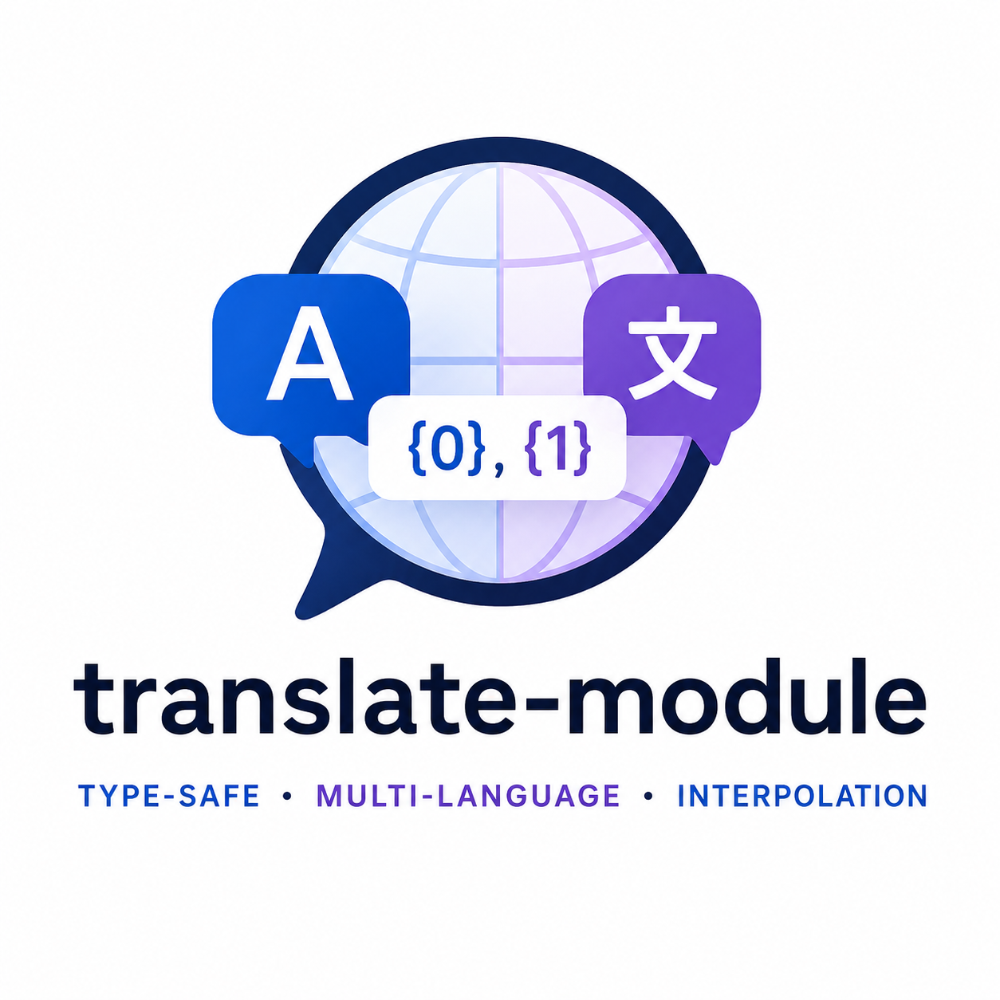

<div align="center">
  

  [](https://www.npmjs.com/package/@xxanderwp/translate-module)
  [](https://www.npmjs.com/package/@xxanderwp/translate-module)
  [](https://github.com/XXanderWP/LangModule/actions/workflows/deploy.yml)
  [](LICENSE)
  [](https://www.typescriptlang.org/)
</div>

# @xxanderwp/translate-module

A lightweight, type-safe TypeScript module for managing multi-language translations with support for interpolation placeholders.

## Features

- Full TypeScript generic type safety — language keys and translation keys are statically inferred
- Runtime language switching via a simple setter
- String interpolation with indexed placeholders (`{0}`, `{1}`, ...)
- Zero runtime dependencies

## Installation

```bash
npm install @xxanderwp/translate-module
```

## Usage

### Basic setup

```ts
import { LanguageCore } from "@xxanderwp/translate-module";

const translations = {
  en: {
    greeting: "Hello, {0}!",
    farewell: "Goodbye!",
  },
  es: {
    greeting: "¡Hola, {0}!",
    farewell: "¡Adiós!",
  },
};

const lang = new LanguageCore(translations, "en");

lang.translate("greeting", "Alice"); // "Hello, Alice!"
```

### Switching language

```ts
lang.currentLanguage = "es";
lang.translate("greeting", "Alice"); // "¡Hola, Alice!"
```

### Accessing available languages

```ts
lang.langKeys; // ["en", "es"]
```

## API

### `new LanguageCore(data, defaultLanguage?)`

| Parameter         | Type        | Description                                                              |
| ----------------- | ----------- | ------------------------------------------------------------------------ |
| `data`            | `T`         | An object mapping language keys to their translation dictionaries.       |
| `defaultLanguage` | `keyof T`   | *(Optional)* The language to activate on construction. Defaults to the first key in `data`. |

Throws if `data` is empty or `defaultLanguage` is not a key of `data`.

---

### `translate(key, ...args)`

Returns the translated string for `key` in the current language, with `{0}`, `{1}`, ... placeholders replaced by the provided `args`.

Returns `null` if the key does not exist or no language is set.

---

### `currentLanguage` *(getter / setter)*

Gets or sets the active language key. Setting an unsupported key throws an error.

---

### `langKeys`

Returns an array of all available language keys.

---

### `languagesData`

Returns the full translations object passed to the constructor.

---

### `currentLanguageData`

Returns the translation dictionary for the currently active language, or `null` if none is set.

## Development

**Build**

```bash
npm run build
```

**Run tests**

```bash
npm test
```

**Run tests with coverage**

```bash
npm run test:coverage
```

## License

[MIT](LICENSE)
